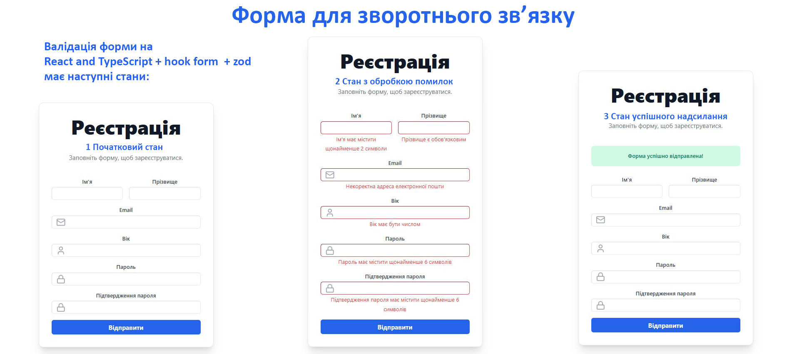

# Валідація форми зворотнього зв'язку

Реалізовано 3 стани форми:

- 1 Початковий стан: Форма готова для заповнення.
- 2 Стан з обробкою помилок: Після спроби надсилання форма показує користувачу, які поля заповнені неправильно.
- 3 Стан успішного надсилання: Форма повідомляє користувача, що його дані були успішно відправлені.

## Використані технології:

React + TypeScript + Hook Form + Zod
